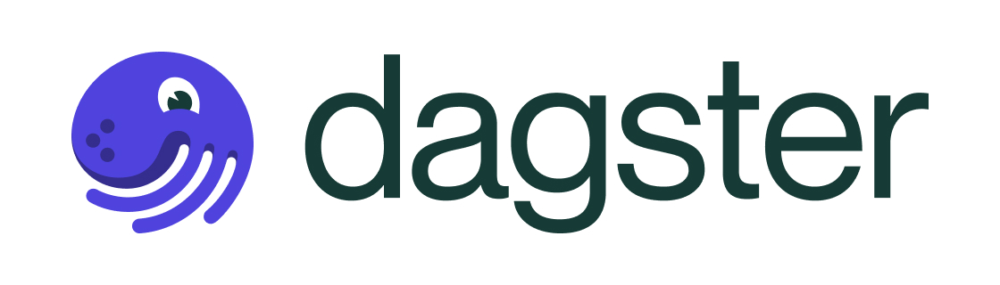

# PulpoCon23 Dagster Workshop

**Notes**:

- *Use "--config core.autocrlf=input" at the end of the git clone command. [More info](https://help.github.com/en/articles/dealing-with-line-endings)*

## Welcome to Dagster Workshop

Dagster is an OpenSource tool that eliminates the barrier between development and operation, and at the same time brings business processes closer. We will discuss its basic concepts and develop a complete data pipeline applying them, always keeping the data in the foreground.

## Let's Start

You will start by reading the [Introduction](doc/README.md), where you will have access to all the chapters of the workshop as well as information about the workshop requirements.

## Repository Structure

| **Name**                     | **Description**                                                                       |
| ---------------------------- | ------------------------------------------------------------------------------------- |
| `.devcontainer`              | configuration to provide a fully featured development environment                     |
| `doc/`                       | each chapter of the workshop will be explained in an extended way here                |
| `docker/`                    | definition of containers on which we will develop                                     |
| `pulpocon23_dagster/`        | python module for Dagster project                                                     |
| `scripts/`                   | utils for makefile                                                                    |
| `tests/`                     | python tests for Dagster project                                                      |
| `Makefile`                   | automating software building procedure                                                |
| `scripts/`                   | utils for makefile                                                                    |
| `pdm.lock`                   | resolved result of all dependencies from pyproject.toml                               |
| `pyproject.toml`             | PDM dependencies configuration                                                        |
| `README.md`                  | description and guide for the code repository                                         |

<!-- footer -->

&nbsp;

&nbsp;

  
<strong>PulpoCon · 2023</strong> Dagster Workshop

  
<code>david.fernandez@nextail.co</code> <code>julien@nextail.co</code>

