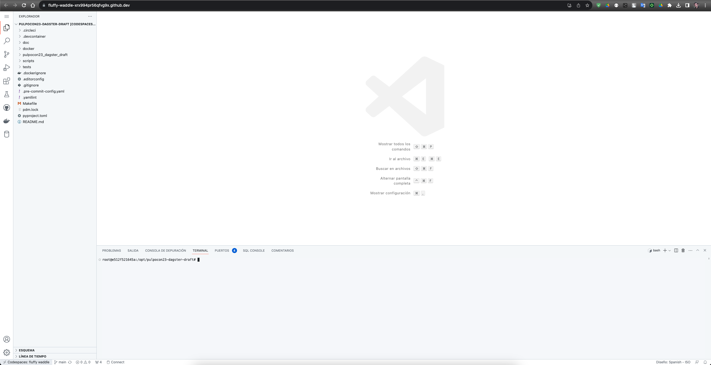
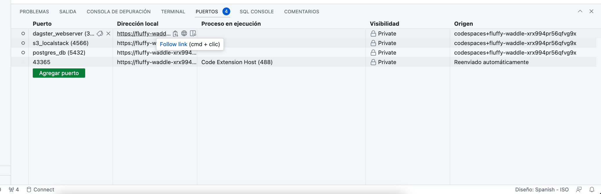

# Introduction

In this workshop you will start to learn some basic Dagster concepts with code examples and we will run the examples on the Dagster web server. We will continue with a practical case, where we will gradually add complexity.

- [Introduction](#introduction)
  - [What is Dagster](#what-is-dagster)
  - [Chapters](#chapters)
  - [Development Environment](#development-environment)
  - [How to Start](#how-to-start)
    - [Work environments](#work-environments)
    - [Start VSCode Devcontainer (Local)](#start-vscode-devcontainer-local)
    - [Start Github Codespace (Cloud)](#start-github-codespace-cloud)
    - [Start services](#start-services)
    - [Run tests](#run-tests)
  - [Makefile Utilities](#makefile-utilities)

## What is Dagster

Dagster is a platform for data flow orchestration that goes beyond what we understand as a data traditional orchestrator. The project was started in 2018 by Nick Shrock and was conceived as a result of a need identified by him while working at Facebook. One of the goals of Dagster has been to provide a **tool that removes the barrier between pipeline development and pipeline operation, but during this journey, he came to link the world of data processing with business processes.**

Dagster provides significant improvements over previous solutions.

- **Oriented to data engineers, developers, and data/business operations engineers:** Its versatility and abstraction allow us to design pipelines in a more developer-oriented way, applying software best practices and managing data, and data pipelines as code.
- *Complies with the First-principles approach* to data engineering, the *full development lifecycle*: development, deployment, monitoring, and observability
- It includes a **new** and differential **concept**, which is a **software-defined asset**. An asset is a data object or machine learning modeled in Dagster and persisted in a data repository.
- Dagster **Webserver** is a interface for viewing and interacting with Dagster objects. A very **intuitive, and user-friendly interface** that allows a very simple operation.
- It is an **open-source solution** that at the same time offers a **SaaS cloud solution** that accelerates the implementation of the solution.


## Chapters

The course is divided into chapters:

- [Chapter 1 - Dagster Basics](./chapter_1/README.md): learn basic concepts with simple definitions and examples to execute.

- [Chapter 2 - Practical Case : The Retailer's KPIs](./chapter_2/README.md): following the instructions of the practical case, you will build a data pipeline autonomously.

## Development Environment

In order to provide a simple working environment for the attendee, the basic architecture of Dagster has been simplified. A `PostgreSQL` Docker image will be used as Storage and two Docker images for `Dagster's Daemon` and `Dagster Webserver`. There is no Docker container for the code as it is mounted as a shared volume in Dagster's containers. In this way it is not necessary to restart the container every time we want to reload the code in Dagster. We will only have to Reload Definitions from the `Dagster Webserver`. To facilitate the development of the integration with Amazon S3 we will use a `Localstack` container with the S3 service active.


| Name              | Description                                                                                                                                                                                         |
|-------------------|-----------------------------------------------------------------------------------------------------------------------------------------------------------------------------------------------------|
| **Postgres**      | The metadata storage persists job and asset history . This includes metadata on runs, event logs, schedule/sensor ticks, and other useful data.                                                     |
| **Daemon**        | The daemon is responsible for long-running process such as schedules, sensors, and run queuing.                                                                                                     |
| **Webserver**     | Webserver is a interface for viewing and interacting with Dagster objects. You can inspect op, job, and graph definitions, launch runs, view launched runs, and view assets produced by those runs. |
| **Localstack S3** | Fully functional local AWS S3.                                                                                                                                                                      |

## How to Start

You have two preconfigured work environments. The recommendation is to use the Local environment, the performance is better than in the Cloud. If you have problems running the Local environment, use the Cloud environment.


### Work environments

The first thing we have to do is decide which work environment we want to use. Our recomendation it's the Local environment, but if you have problems please use the Cloud environment.

- **Local environment with [Devcontainer](https://code.visualstudio.com/docs/devcontainers/containers)**: work with Docker installed on the user's machine and VS Code Devcontainer.
  - **Requirements**:
    - `Docker`
    - `Git`
    - `VSCode`
    - `OS support`
      - `Windows (Docker with WSL2 backend is preferred over Hyper-V)` 
      - `macOs`
      - `Linux: Debian 9+, Ubuntu 20.04+, and downstream distros.`
  - **Benefits**:
    - For free.
    - The resources used (CPU, Memory, Disk) are set by you. You are not limited by the platform.
    - Once configured, the stability and execution speed of the tools is superior.
    - Local data persistence.
  - **Cons**:
    - All tools need to be installed and configured.

- **Cloud environment with [Github Codespaces](https://docs.github.com/en/codespaces/overview)**: work with GitHub Codespaces on Cloud.
  - **Requirements**:
    - Github account
  - **Benefits**:
    - Speed with which we will start working.
    - Isolated environment, we can connect from any computer.
  - **Cons**:
    - Limited Free Usage Hours
    - Ephemeral data persistence (we must be careful and not delete the environment without first saving what we need in the repository).
    - Less performance with the same resources as local.

### Start VSCode Devcontainer (Local)

1. Clone the [Repository](https://github.com/nextail/pulpocon23_dagster) with the command `git clone https://github.com/nextail/pulpocon23_dagster --config core.autocrlf=input` in your favorite directory. [More info](https://help.github.com/en/articles/dealing-with-line-endings)
2. Open with `VSCode` the folder `pulpocon23_dagster``.
3. Press devcontainer button `><` on the left-down-side of the VSCode. Then select `Reopen in Container`.

4. It is possible that if you have less than 4 CPUs and 8 GB of Memory assigned to Docker, a window will appear warning you. Make sure that the values are at least close to the requirements and press `Continue`. Otherwise, `Cancel` and upgrade the Docker resources before trying again.

5. Wait for the devcontainer build to finish. You will know that it has finished when the terminal shows: `Done. Press any key to close the terminal`


### Start Github Codespace (Cloud)

1. Go to the [Repository](https://github.com/nextail/pulpocon23_dagster).
2. Click `<> Code`, then click `Codespaces` > `Your workspaces in the cloud` > `+`.
  
3. Environment begins to be created
  
4. The VSCode web version opens. Wait until the window stops doing tasks and is stable.
  

### Start services

To start services run the command:

```bash
make start-dev
```

The first time you run this command, will be built the docker containers where Dagster Daemon, Dagster Webserver, Postgres and S3 Localstack will run. At the end of the construction, the terminal will show us:

```log
[+] Running 5/5
 ✔ Network pulponet             Created                                                                                            0.0s
 ✔ Container s3_localstack      Started                                                                                            0.6s
 ✔ Container postgres_db        Started                                                                                            0.5s
 ✔ Container dagster_webserver  Started                                                                                            0.9s
 ✔ Container dagster_daemon     Started                                                                                            []
```

To open Dagster you must go to the ports tab and open the generated link.
- Devcontainer

- Codespace


### Run tests

```bash
pytest tests
```

```log
root@03ff4d1d661a:/opt/pulpocon23-dagster# pytest tests
================================================ test session starts ================================================
platform linux -- Python 3.10.13, pytest-7.4.1, pluggy-1.3.0
rootdir: /opt/pulpocon23-dagster
configfile: pyproject.toml
plugins: anyio-4.0.0
collected 3 items

tests/chapter_1/test_asset_with_config.py .                                                                   [ 33%]
tests/chapter_1/test_graph.py .                                                                               [ 66%]
tests/chapter_1/test_op.py .                                                                                  [100%]

================================================= 3 passed in 1.31s =================================================
```

## Makefile Utilities

| **Action**            | **Description**                                                     |
| ----------------------| ------------------------------------------------------------------- |
| **help**              | show this help                                                      |
| **deps**              | test if the dependencies we need to run this Makefile are installed |
| **start-dev**         | start the docker environment in background                          |
| **start-dev-nocache** | start the docker environment in background without cache on build   |
| **stop-dev**          | stop the the docker environment in background                       |
| **clean**             | clean all the created containers                                    |
| **clean-full**        | clean all the created containers and their data                     |
