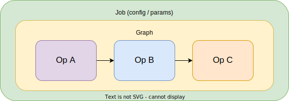

# Chapter 1

During this first chapter you will learn basic concepts with simple definitions and examples to execute.

## Ops, Jobs & Graphs

- **Op**: Core unit of computation, the tasks we want to execute. It contains the operations and should perform simple tasks such as executing a database query (to ingest or retrieve data), initiating a remote job (Spark, Python, etc.), or sending an event.

- **Graph**: Set of interconnected ops of sub-graphs, ops can be assembled into a graph to accomplish complex tasks.

- **Job**: Main unit of execution and monitoring; instantiation of a Graph with configurations and parameters.

    

**Code Example:**

```python
@op
def add_numbers(context, num1: int, num2: int) -> int:
    result = num1 + num2
    context.log.info(f"Adding {num1} + {num2} = {result}")
    return result


@op
def multiply_by_two(context, number: int) -> int:
    result = number * 2
    context.log.info(f"Multiplying {number} by 2 = {result}")
    return result


@graph
def math_operations():
    multiplied = multiply_by_two(add_numbers())
    add_numbers(multiplied, add_numbers())


@job
def example_math_job():
    math_operations()
```

[**Go to Dagster Webserver Job**](http://localhost:3000/locations/chapter-1-dagster_basics/jobs/example_math_job)

**More Info**:

- [**Op**](https://docs.dagster.io/concepts/ops-jobs-graphs/ops)
- [**Graph**](https://docs.dagster.io/concepts/ops-jobs-graphs/graphs)
- [**Job**](https://docs.dagster.io/concepts/ops-jobs-graphs/jobs)

## Assets

- An **Asset** is an object in persistent storage, such as a table, file…

    **Code Example:**

    ```python
    @asset
    def my_asset():
        return [1, 2, 3]
    ```

- Dagster lets you track the interactions between ops, outputs, and assets over time and view them in the Dagit Asset Catalog.

    - [Asset Lineage](http://localhost:3000/asset-groups)

    - [Asset List](http://localhost:3000/assets)

- **AssetObservation** events are used to record metadata in Dagster about a given asset.

    **Code Example:**

    ```python
    @op
    def daily_stock_op(context):
        store_data = json.loads(STORE_STOCK)
        daily_stock = sum(item["Stock"] for item in store_data["warehouse"])
        context.log.info(daily_stock)
        context.log_event(
            AssetObservation(
                asset_key="examples/daily_stock",
                metadata={"daily_stock": daily_stock},
            )
        )
        return daily_stock


    @job
    def daily_stock_job():
        daily_stock_op()
    ```

    [**Go to Dagster Webserver Job**](http://localhost:3000/locations/chapter-1-dagster_basics/jobs/daily_stock_job)

- **Software-defined assets** enable a declarative approach to data management, in which code is the source of truth on what data assets should exist and how those assets are computed.  Is a Dagster object that couples an asset to the function and upstream assets used to produce its contents. This allow us to define data contracts as code.

- **Materializing an Asset** is the act of running its op and saving the results to persistent storage.

    **Code Example:**

    *With the previous example, if we define this Op as an Asset, the output of this Asset its a materialization.*

    ```python
    @asset(key_prefix=["examples"], group_name="stock", name="daily_stock_asset")
    def daily_stock_asset(context):
        store_data = json.loads(STORE_STOCK)
        daily_stock = sum(item["Stock"] for item in store_data["warehouse"])
        context.log.info(daily_stock)
        return daily_stock
    ```

- **Upstream / Downstream** are Asset direct dependencies.

    **Code Example:**

    *Now you are going to add dependencies, it's expected that if you need direct access to the contents of the asset, the code you include inside your @asset-decorated function will load the data from the `upstream asset`.*

    ```python
    @asset(key_prefix=["examples"], group_name="stock", name="daily_stock_asset")
    def daily_stock_asset(context):
        store_data = json.loads(STORE_STOCK)
        daily_stock = sum(item["Stock"] for item in store_data["warehouse"])
        context.log.info(daily_stock)
        return daily_stock


    @asset(key_prefix=["examples"], group_name="stock", name="weekly_stock_asset", deps=[daily_stock_asset])
    def weekly_stock_asset():
        pass


    @asset(
        key_prefix=["examples"],
        group_name="forecast",
        name="forecast_next_month_asset",
        deps=[weekly_stock_asset, daily_stock_asset],
    )
    def forecast_next_month_asset():
        pass
    ```

    **Link to Dagster Assets**:

    - [**Daily Stock Asset**](http://localhost:3000/assets/examples/daily_stock_asset)
    - [**Weekly Stock Asset**](http://localhost:3000/assets/examples/weekly_stock_asset)
    - [**Forecast Next Month Asset**](http://localhost:3000/assets/examples/forecast_next_month_asset)


- If generating an asset involves multiple discrete computations, you can use **graph_assets** by separating each computation into an op and assembling them into an op graph to combine your computations.

    **Code Example:**

    *In case you want to obtain the forecast for the next month, dagster must know that it needs to have calculated the assets on which it depends previously and in case of not having calculated the data, it would calculate it.*

    ```python
    @op
    def daily_stock_op(context):
        store_data = json.loads(STORE_STOCK)
        daily_stock = sum(item["Stock"] for item in store_data["warehouse"])
        context.log.info(daily_stock)
        context.log_event(
            AssetObservation(
                asset_key="examples/daily_stock",
                metadata={"daily_stock": daily_stock},
            )
        )
        return daily_stock

    @graph_asset(key_prefix=["examples"], group_name="stock", name="daily_stock_asset_from_op")
    def daily_stock_as_asset_from_op():
        daily_stock = daily_stock_op()
        return daily_stock
    ```

    [**Go to Dagster Webserver Asset**](http://localhost:3000/assets/examples/daily_stock_as_asset_from_op)

- An amazing capability is being able to use external tools such as DBT, Snowflake, Airbyte, Fivetran, and many others tools to define our assets. It is amazing because it allows us to be integrated into our global platform and not only in the big data ecosystem.

****More info****:

- [**Software Defined Assets**](https://docs.dagster.io/concepts/assets/software-defined-assets)
- [**Asset Observations info**](https://docs.dagster.io/concepts/assets/asset-observations)
- [**Graph-Backed Assets**](https://docs.dagster.io/concepts/assets/graph-backed-assets#graph-backed-assets)

## Input/Output Types

- With the **Ins** and **Out** classes you can define what type of data input and output your operation. Dagster will take care of doing the validation using a **Dagster Type**, and if it is not valid, an exception will be raised. Dagster types are very flexible, you can create your own custome types and support standard Python data types as `String`, `Int`, `List`, etc.

    **Code Example:**

    ```python
    @op
    def return_number() -> str:
        return "a"


    @op(
        ins={"number_in": In(Int)},
        out={"numer_out": Out(Int)},
    )
    def add_one(number_in):
        number_out = number_in + 1
        return number_out


    @job
    def number_validation_job():
        add_one(return_number())
    ```

    **Failure message:**

    ```log
    dagster._core.errors.DagsterTypeCheckDidNotPass: Type check failed for step input "number_in" - expected type "Int". Description: Value "a" of python type "str" must be a int.
    ```

    [**Go to Dagster Webserver Job**](http://localhost:3000/locations/chapter-1-dagster_basics/jobs/number_validation_job)

    [**More info**](https://docs.dagster.io/concepts/ops-jobs-graphs/ops#inputs-and-outputs)

## Resources and Run Configuration

### Resources

- **Resources** are objects that are shared across the implementations of multiple `software-defined assets`, `ops`.. Typically model external components. For example, a resource might be a connection to a data warehouse or a service like Slack. A resource can be associated accross multiple ops.

    **Code Example:**

    ```python
    class CredentialsResource(ConfigurableResource):
        username: str
        password: str

    defs = Definitions(
        resources={
            "credentials": CredentialsResource(
                username="foo",
                password="bar",
            )
        }
    )

    @asset(
        key_prefix=["examples"],
        group_name="resources",
    )
    def recover_credentials_asset(context, credentials: CredentialsResource):
        user = credentials.username
        password = credentials.password
        context.log.debug(f"User:{user}, Pass:{password}")
    ```

    **Link to Dagster Resources:**:

    - [**Resource**](http://localhost:3000/locations/chapter-1-dagster_basics/resources/credentials)
    - [**Go to Dagster Webserver Asset**](http://localhost:3000/assets/examples/recover_credentials_asset)

    [**More info**](https://docs.dagster.io/concepts/resources#resources)

### Run Configuration

- **Run configuration** allows providing parameters to jobs at the time they're executed. It's often useful to provide user-chosen values to Dagster `jobs` or `software-defined assets` at runtime. It allows you to parameterize pipelines without having to change the pipeline code and be able to use it for different executions. It is useful for promoting a pipeline between different environments, which will have different configurations.

  **Code Example:**

  ```python
  class InputConfig(Config):
      name: str

  @asset()
  def recover_name_asset(context, config: InputConfig) -> str:
      name = config.name
      context.log.debug(f"My name is: {name}")
      return name
  ```

  [**Go to Dagster Webserver Asset**](http://localhost:3000/assets/examples/recover_name_asset)

  **Code Example:**

  *`Hardcoded configuration`: You can supply a config dictionary. The supplied dictionary will be used to configure the Job whenever the Job is launched. It will show up in the Dagstter Webserver Launchpad and can be overridden.*

  ```python
  @op
  def recover_name_op(context, config: InputConfig) -> str:
      name = config.name
      context.log.debug(f"My name is: {name}")
      return name


  recover_name_job_config = RunConfig({"recover_name_op": InputConfig(name="Alice")})


  @job(config=recover_name_job_config)
  def recover_name_job():
      recover_name_op()
  ```

  [**Go to Dagster Webserver Job**](http://localhost:3000/locations/chapter%201%3A%20dagster's%20basics/jobs/recover_name_job/)

  [**More info**](https://docs.dagster.io/concepts/configuration/config-schema#defining-and-accessing-configuration-for-an-op-or-asset)

## Partitions

- Generally when you save data you do it in some organized way, `Dagster Assets` provide **Partitions** to fulfill this necessity. Partitions provide us with the ability to reexecute jobs not executed, failed, or whose input changed. In summary, Partitions allow us to independently execute materializations and perform more detailed trancking.

    **Code Example:**

    *The typical case of partitioning would be by time window. In our example we see a daily partitioning, where the initial date is September 4, 2023. The partitions will allow us to launch this job for each day from the established initial date, being able to launch all or each one independently.*

    ```python
    @asset(
        partitions_def=DailyPartitionsDefinition(start_date="2023-09-04"),
        key_prefix=["example"],
        group_name="partitions",
    )
    def partition_asset(context) -> Output[DataFrame]:
        partition_date = context.asset_partition_key_for_output()
        data = pd.read_csv(
            f"https://raw.githubusercontent.com/dfernandezcalle/stock-data/main/data/csv/{partition_date}/stock.csv"
        )
        return Output(data, metadata={"lines": len(data.index)})
    ```

    [**Go to Dagster Webserver Asset**](http://localhost:3000/assets/example/partition_asset)

    [**More info**](https://docs.dagster.io/concepts/partitions-schedules-sensors/partitions)

## IO Managers

- `I/O Managers` are user-provided objects that store `asset` and `op` outputs and load them as inputs to downstream assets and ops. They can be a powerful tool that helps you reduce boilerplate code and easily change where your data is stored.

    It is important to warn that each output of an `op`/`asset` is persisted in the associated `I/O Manager` (by default Dagster persists in FileSystem). Therefore you must be careful when performing complex operations the "weight" of your outputs and the number of operations/assets you need.

    **Code Example:**

    ```python
    @asset(io_manager_key="fs_io_manager")
    def give_me_five_asset():
        return 5

    defs = Definitions(
        resources={
            "fs_io_manager": FilesystemIOManager()
        }
    )
    ```

    [**Go to Dagster Webserver Asset**](http://localhost:3000/assets/example/partition_asset)

    [**More info**](https://docs.dagster.io/concepts/io-management/io-managers)

## Others

- **Schedules**: It is used to execute a job at a fixed interval.
- **Sensors**: Allow us to run based on some external event such as Kafka event, new files in S3, specific asset materialization, or a data partition update.
- **Backfills**: It provides the ability to re-execute the data pipeline on only the set of partitions we are interested in.
- **Metadata**: Dagster allows meta-information to be added practically at all levels and most importantly it is very accessible by data ops or any other operational user. Having metadata is very important but it must also be usable and that is where Dagster makes a difference.

## Testing

- Dagster allows you to write unit-tests for your data applications, it allows you to separate the business logic from the environments.

>The following examples can be run with `pytest` from the devcontainer terminal in the folder `tests/chapter_1`

### Op Test

```python
context = build_op_context()

def test_add_numbers():
    assert add_numbers(context, num1=1, num2=2) == 3
```

[**More info**](https://docs.dagster.io/concepts/testing#testing-ops)

### Graph Test

```python
config ={"ops":{"add_numbers":{"inputs":{"num1":1,"num2":2}},"add_numbers_2":{"inputs":{"num1":1,"num2":2}}}}

def test_math_operations():
    result = math_operations.execute_in_process(run_config=config)
    assert result.success
```

[**More info**](https://docs.dagster.io/concepts/testing#testing-graphs)

### Asset Test

```python
def test_asset_with_configuration():
    asset_result = materialize(
        [recover_name_asset],
        run_config=RunConfig({"recover_name_asset": InputConfig(name="Alice")}),
    )
    assert asset_result.success
```

[**More info**](https://docs.dagster.io/guides/dagster/testing-assets)
